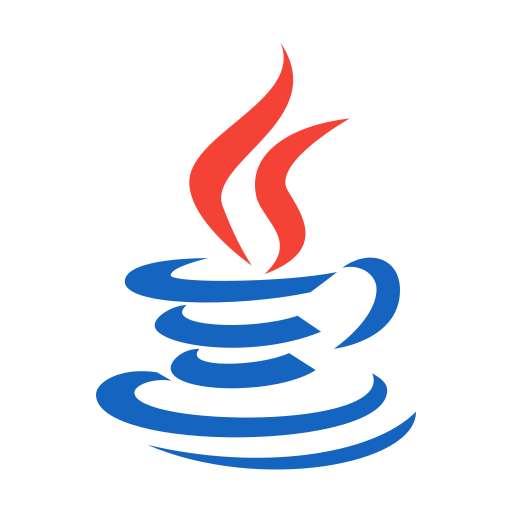

<!-- Best-README-Template: https://github.com/othneildrew/Best-README-Template -->

<!-- PROJECT SHIELDS -->

[![Stargazers][stars-shield]][stars-url]
[![project_license][license-shield]][license-url]
[![LinkedIn][linkedin-shield]][linkedin-url]

<!-- PROJECT LOGO -->
 

  

<h3 align="center">Java Back-End</h3>

  

    Explorando desafios em Java
     
    <a href="https://github.com/Ozakye"><strong>Confira meus repos »</strong></a>
     
     
    <a href="https://www.dio.me/users/bruna_ozaki">Perfil</a>
    &middot;
    <a href="https://web.dio.me/users/bruna_ozaki?tab=achievements">Perfil DIO</a>
    &middot;
    <a href="https://dio.me">Plataforma DIO</a>
  

<!-- TABLE OF CONTENTS -->

  
Conteúdos

  <ol>
    <li>
      <a href="#sobre-o-projeto">Sobre o Projeto</a>
      <ul>
        <li><a href="#construído-em">Construído em</a></li>
      </ul>
    </li>
    <li>
      <a href="#getting-started">Getting Started</a>
    <li><a href="#desafios">Desafios</a></li>
  </ol>

<!-- ABOUT THE PROJECT -->
## Sobre o Projeto

Projeto de Java Back-end feito a partir do bootcamp Santander pela DIO.

(<a href="#readme-top">voltar ao topo</a>)

### Construído em

* [![IntelliJ IDEA][IntelliJ-IDEA]][IntelliJ-url]
* [![VS Code][VS-Code]][VS-Code-url]
* [![VSC Workspace][VSC-Workspace]][VSC-Workspace-url]

(<a href="#readme-top">voltar ao topo</a>)

<!-- GETTING STARTED -->
## Getting Started

This is an example of how you may give instructions on setting up your project locally.
To get a local copy up and running follow these simple example steps.

(<a href="#readme-top">voltar ao topo</a>)

<!-- CHALLENGES -->
## Desafios

- [Banco Digital](Banco%20Digital/)
- [Controle de Fluxo](Controle%20de%20Fluxo/)
- [Design Patterns Java](Design%20Patterns%20Java/)
- [POO](POO/)
- [Sintaxe](Sintaxe/)
- [Sudoku](Sudoku/)

 

(<a href="#readme-top">voltar ao topo</a>)

<!-- MARKDOWN LINKS & IMAGES -->
[stars-shield]: https://img.shields.io/github/stars/Ozakye/Java-Back-End.svg?style=for-the-badge
[stars-url]: https://github.com/Ozakye/Java-Back-End/stargazers
[license-shield]: https://img.shields.io/github/license/Ozakye/Java-Back-End.svg?style=for-the-badge
[license-url]: https://github.com/Ozakye/Java-Back-End/blob/master/LICENSE.txt
[linkedin-shield]: https://img.shields.io/badge/-LinkedIn-black.svg?style=for-the-badge&logo=linkedin&colorB=555
[linkedin-url]: https://linkedin.com/in/ozaky
[product-screenshot]: images/screenshot.png
[IntelliJ-IDEA]: https://img.shields.io/badge/intellij%20idea-097cfb?style=for-the-badge&logo=intellijidea&logoColor=white
[IntelliJ-url]: https://www.jetbrains.com/idea
[VS-Code]: https://img.shields.io/badge/VS%20Code-282A36?style=for-the-badge&logo=data:image/png;base64,iVBORw0KGgoAAAANSUhEUgAAAB4AAAAeCAMAAAAM7l6QAAABPlBMVEVHcEwjq/MAfcUjqPIAc7UipvImtPQAh9IAjtUAcbQAidIAcrQAfMMAfMQAfcMAj9UAa68AiNEAbbAAjtUAdLgAhtEAcbQAbrEAc7cAhtEAcLQAgs8AcLMAecADhs0ms/MAdr4AfL0Yl+IAj9UAhtEAgs8AbbAAeLoAidIAhdEAfcQAbbEAfMUAhtEmsvMAfMUgn/AfnvAmtPQAfMUAfc0gnvEAfMUbl+sDfM8AdbcAjtQmsfMgn/EAg9AAjtQAd7gAfM0epeYlsPQAjNQmsvQAgM8AerwAg9AAh9EAdbcho/IkrPIip/IAidMhofIAdrkgn/EjqvIipfEAbrEAbbAAj9UjqfIhpPEkrvMAhdAAd7gjqPIAeLoAiNIAcrUAf80Sj9QAfM0Ad8sAaa4QiN0AecEQit0Tk9YQjN4Qi95X0gmOAAAAQnRSTlMAfwEcp37+ocHYJSYNEATcjxY1NctOHRbt7eEdToLh0l7yt4rLuMW4rNVBvJN8agnVanVz9nVj0+V59u/vNF80y9kMN8bdAAABiElEQVQoz3XTZ1fCMBSA4QCVQlEEZclGUEEc4MStWEtBoWpbQGW6/f9/wCQ3IqM8nzjnLek9aYKQgXj0aseCpjAfJJQva2zL+AHnbkLCWbTGjFbYjiQkqdwTidjWeJ3bkKRBFk/Gqp8jtdXpiUWKjPJffWstqtMrNimEBD7pZiM7WH3+z4s2Xbct0nzheQaKZ7nJ8ryOzZ87EVq3KwznM41k/TjpDgfLIHA0i0y3AC9+TaUCaodWexi/Z5CRwLqsaB38AOcgY5geAP4ZSkOvfmhqIDKLhnKd7hRfBd1gmG2CqQ5o5j7a0KPev/wCyFZx2pvy1KaWNmHxmTuAkCOrqriXZKItp4WRvLCqqqR7lmSQ8ZL8CJBdpVx+b/QJkBew3EB2DQvGyaZmSgwfmmkAvLimZRfoPGepv365XAF4NJfLzz63sHID+t+VGjVyHMwh1vs/tUEe5uZJ7b5+1u6pyaPYxV7foZ4aHOS9fp/lXH7yjjh39yDn9i3Gl6iA82F+6i2LFw7ZP38B4MeP/mPiC3oAAAAASUVORK5CYII=
[VS-Code-url]: https://code.visualstudio.com
[VSC-Workspace]: https://img.shields.io/badge/VSC%20Workspace-282A36?style=for-the-badge&logo=data:image/png;base64,iVBORw0KGgoAAAANSUhEUgAAAB4AAAAeCAMAAAAM7l6QAAABPlBMVEVHcEwjq/MAfcUjqPIAc7UipvImtPQAh9IAjtUAcbQAidIAcrQAfMMAfMQAfcMAj9UAa68AiNEAbbAAjtUAdLgAhtEAcbQAbrEAc7cAhtEAcLQAgs8AcLMAecADhs0ms/MAdr4AfL0Yl+IAj9UAhtEAgs8AbbAAeLoAidIAhdEAfcQAbbEAfMUAhtEmsvMAfMUgn/AfnvAmtPQAfMUAfc0gnvEAfMUbl+sDfM8AdbcAjtQmsfMgn/EAg9AAjtQAd7gAfM0epeYlsPQAjNQmsvQAgM8AerwAg9AAh9EAdbcho/IkrPIip/IAidMhofIAdrkgn/EjqvIipfEAbrEAbbAAj9UjqfIhpPEkrvMAhdAAd7gjqPIAeLoAiNIAcrUAf80Sj9QAfM0Ad8sAaa4QiN0AecEQit0Tk9YQjN4Qi95X0gmOAAAAQnRSTlMAfwEcp37+ocHYJSYNEATcjxY1NctOHRbt7eEdToLh0l7yt4rLuMW4rNVBvJN8agnVanVz9nVj0+V59u/vNF80y9kMN8bdAAABiElEQVQoz3XTZ1fCMBSA4QCVQlEEZclGUEEc4MStWEtBoWpbQGW6/f9/wCQ3IqM8nzjnLek9aYKQgXj0aseCpjAfJJQva2zL+AHnbkLCWbTGjFbYjiQkqdwTidjWeJ3bkKRBFk/Gqp8jtdXpiUWKjPJffWstqtMrNimEBD7pZiM7WH3+z4s2Xbct0nzheQaKZ7nJ8ryOzZ87EVq3KwznM41k/TjpDgfLIHA0i0y3AC9+TaUCaodWexi/Z5CRwLqsaB38AOcgY5geAP4ZSkOvfmhqIDKLhnKd7hRfBd1gmG2CqQ5o5j7a0KPev/wCyFZx2pvy1KaWNmHxmTuAkCOrqriXZKItp4WRvLCqqqR7lmSQ8ZL8CJBdpVx+b/QJkBew3EB2DQvGyaZmSgwfmmkAvLimZRfoPGepv365XAF4NJfLzz63sHID+t+VGjVyHMwh1vs/tUEe5uZJ7b5+1u6pyaPYxV7foZ4aHOS9fp/lXH7yjjh39yDn9i3Gl6iA82F+6i2LFw7ZP38B4MeP/mPiC3oAAAAASUVORK5CYII=
[VSC-Workspace-url]: https://vscode.dev
